### Use Horizon to Create a Wordpress site with separate web, db, and storage servers

**Login to Horizon by going to the following URL in your web browser:**
```
http://<IP_OF_Openstack>/dashboard
```

**First go to:**
```
Project -> Compute -> Key Pairs
```

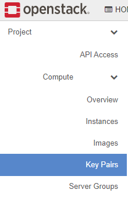

and add an SSH key from the machine you will be SSH'ing in from

Now let's create some security groups.

**Go to:**
```
Project -> Network -> Security Groups
```
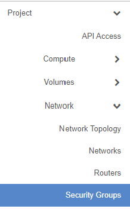

**Click on `Create Security Group`:**  
  
  
**Give the Security Group a name of `SSH`:**  
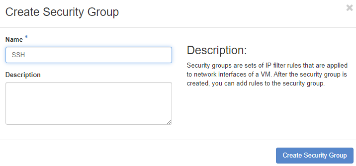  
  
**Find your Security Group in the list and click on `Manage Rules`:**  
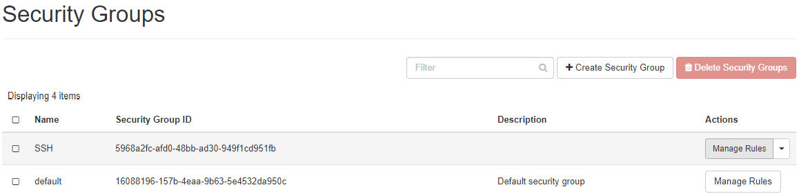  
  
**Click on `Add Rule`:**  
  
  
**In the `Rule` dropdown at the top select `SSH` and click `Add`:**  
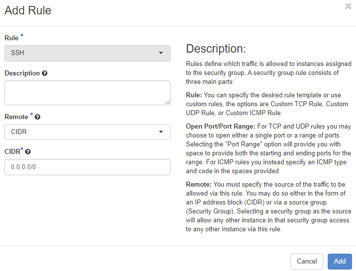  
  
**Add a Rule for ICMP to the `SSH` Security Group and then create the following additional Security Groups:**  
```
Security-Group:
  - name: mysql
    - Rules:
      - MYSQL
  - name: web
    - Rules:
      - HTTP
      - HTTPS
  - name: nfs
    - Rules:
      - Custom TCP Rule:
        - Port: 111
      - Custom TCP Rule:
        - Port: 2049
      - Custom UDP Rule:
        - Port: 111
      - Custom UDP Rule:
        - Port: 2049
```
  
Next let's create a web server.  
  
**Go to:**  
```
Project -> Compute -> Instances
Launch Instance
```
  
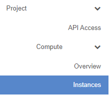  
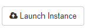  
  
**Give the Instance a name of `wp-web1`:**  
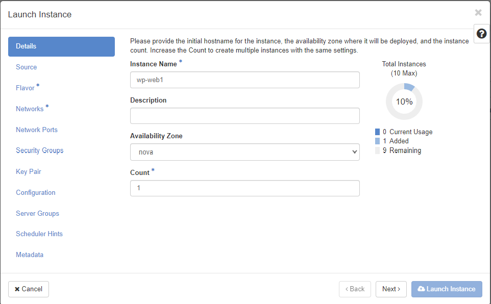  
  
**For the Boot Source use an `image` say `No` to `Create New Volume` and select the `CentOS 8` image:**  
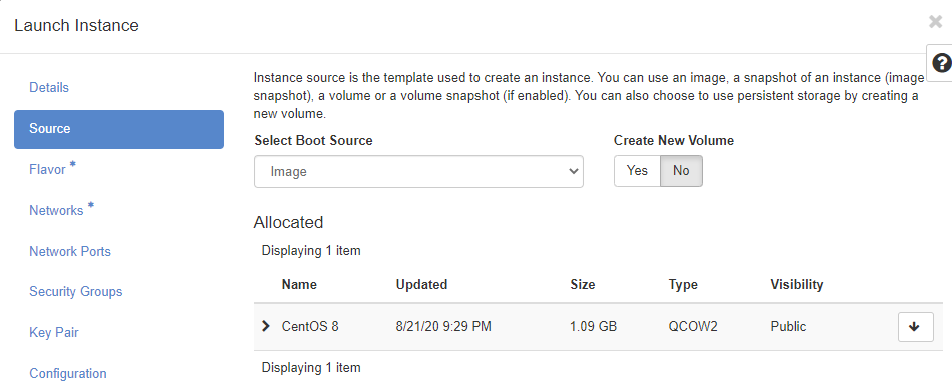  
  
**For the Flavor just use `small` or if you created your own use one with 1 vCPU and at least 512MB of RAM:**  
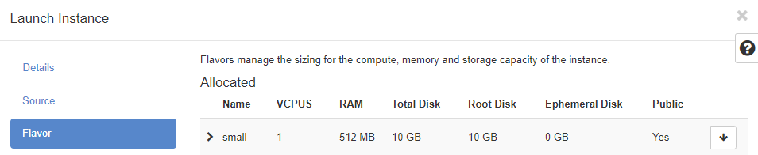  
  
**For the Networks just add the `INTERNAL_NET` network:**  
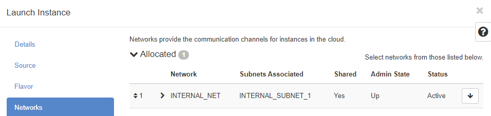  
  
**For the Security Groups allocate the `web` and `SSH` Security Groups:**  
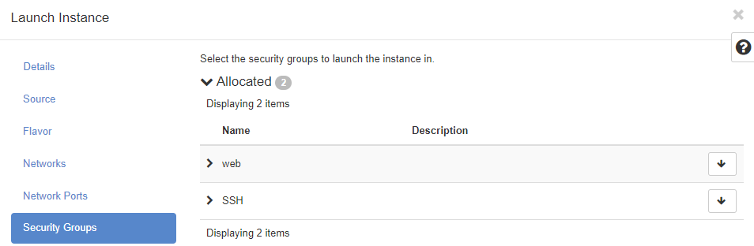  
  
**For the Key Pair add the SSH key from the machine you will be SSH'ing in from:**  
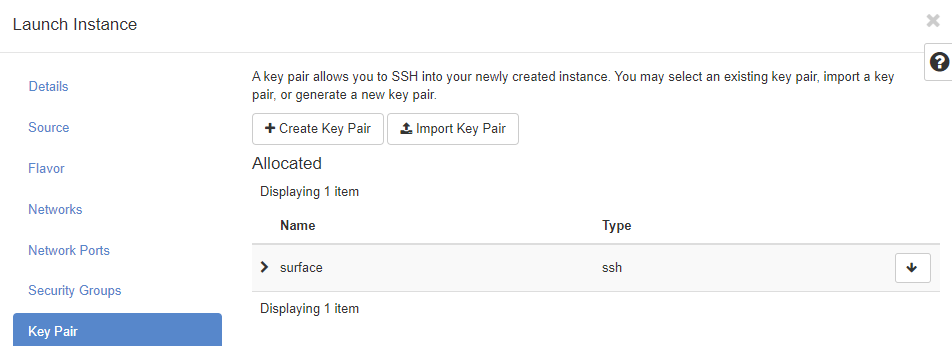  
  
**Now click on `Launch Instance`:**  
  
  
**Follow the same Instance creation steps to create the following 2 instances:**  
```
Instance:
  - name: wp-db
    - Boot Source: image
    - Create New Volume: No
    - Image: CentOS 8
    - Flavor: small
    - Networks: INTERNAL_NET
    - Security Groups:
      - SSH
      - mysql
    - Keypair: <your_ssh_key>
    - Allocate Floating IP: Yes
  - name: wp-storage
    - Boot Source: image
    - Create New Volume: No
    - Image: CentOS 8
    - Flavor: small
    - Networks: INTERNAL_NET
    - Security Groups:
      - SSH
      - nfs
    - Keypair: <your_ssh_key>
    - Allocate Floating IP: Yes
```
  
**SSH into `wp-db` and run the following commands:**  
```
Note: The username for CentOS cloud images is `centos` and be sure to SSH into the Floating IP
```
```
dnf install -y mariadb-server vim bash-completion
systemctl enable mariadb
systemctl start mariadb
mysql_secure_installation
  - Enter current password for root (enter for none): <blank>
  - Set root password? [Y/n]: y
  - New password: <pick_a_password>
  - Remove anonymous users? [Y/n]: y
  - Disallow root login remotely? [Y/n]: y
  - Remove test database and access to it? [Y/n]: y
  - Reload privilege tables now? [Y/n]: y
echo "[client]" > ~/.my.cnf
echo "user=root" >> ~/.my.cnf
echo "password=<YOUR_MYSQL_ROOT_PASSWORD>" >> ~/.my.cnf
mysql -e "CREATE DATABASE wordpress"
mysql -e "CREATE USER 'wordpress_user'@'%' IDENTIFIED BY 'password12345'"
mysql -e "GRANT ALL ON wordpress.* TO 'wordpress_user'@'%'"
mysql -e "FLUSH PRIVILEGES"
```
  
**SSH into `wp-storage` and run the following commands:**  
```
Note: The username for CentOS cloud images is `centos` and be sure to SSH into the Floating IP
```
```
sudo -i
dnf install -y dnf nfs-utils vim bash-completion
systemctl enable nfs-server
mkdir -p /var/www/html/
echo "/var/www/html 192.168.0.0/24(rw,sync,no_root_squash)" >> /etc/exports
systemctl start nfs-server
setenforce 0
sed -i 's/SELINUX=enforcing/SELINUX=permissive/' /etc/selinux/config
```
  
**SSH into `wp-web1` and run the following commands:**  
```
Note: The username for CentOS cloud images is `centos` and be sure to SSH into the Floating IP
```
```
sudo -i
dnf install -y httpd mariadb-common php-fpm php-mysqlnd wget php-json tar bash-completion vim nfs-utils nfs4-acl-tools
systemctl enable httpd && systemctl start httpd
echo "192.168.0.189:/var/www/html /var/www/html nfs defaults 0 0" >> /etc/fstab
mount -a
wget https://www.wordpress.org/latest.tar.gz
tar -xzvf latest.tar.gz
cp -R wordpress/* /var/www/html/
cp /var/www/html/wp-config-sample.php /var/www/html/wp-config.php
sed -i 's/database_name_here/wordpress/' /var/www/html/wp-config.php
sed -i 's/username_here/wordpress_user/' /var/www/html/wp-config.php
sed -i 's/password_here/password12345/' /var/www/html/wp-config.php
sed -i 's/localhost/<INTERNAL_NET_IP_OF_wp-db_SERVER/' /var/www/html/wp-config.php
setenforce 0
sed -i 's/SELINUX=enforcing/SELINUX=permissive/' /etc/selinux/config
```
  
**Now you can hit the floating IP of your `wp-web1` server in your web browser to configure wordpress:**  
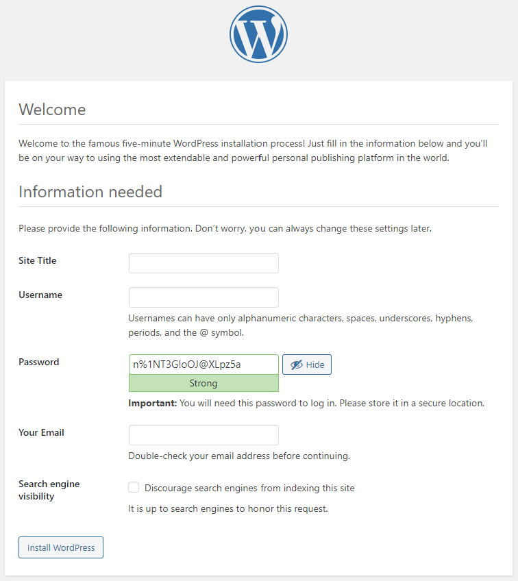  
  


[<-- Back to LABs](../README.md)
[<-- Back to Main](../../README.md)
