### These are the steps to install a minimal CentOS 8 OS for Packstack

**Select your language and click Continue**
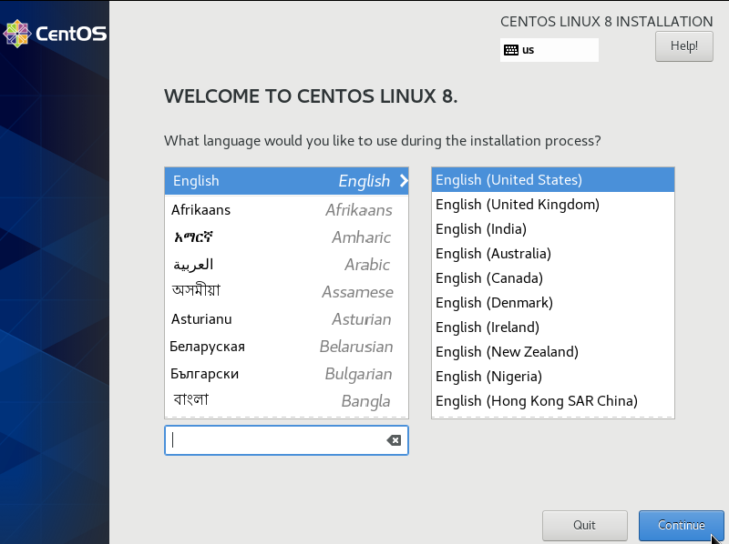

**Click on Software Selection**
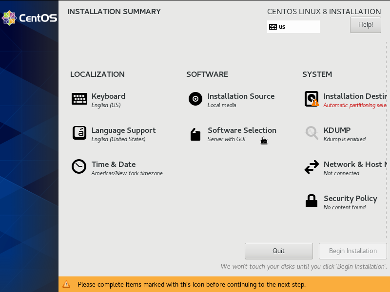

**Change the Base Environment to Minimal Install and click Done**
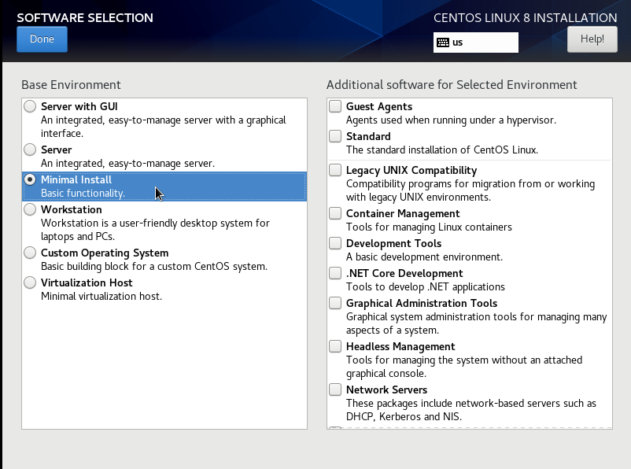

**Click on Installation Desintation**
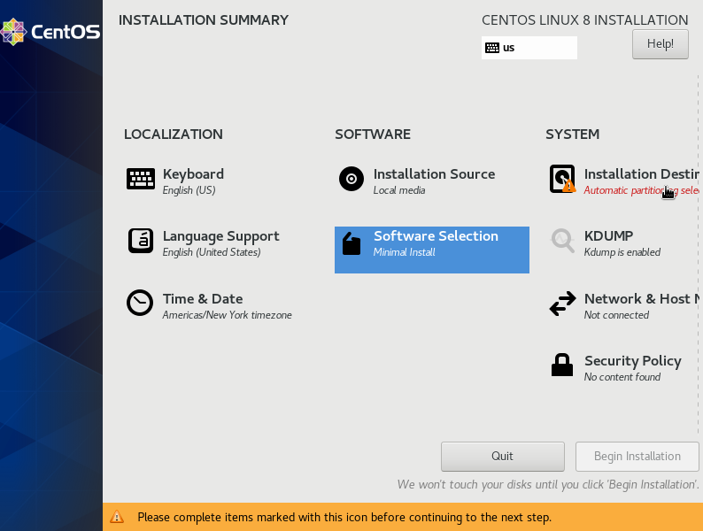

**Select Custom for the Storage Configuration**
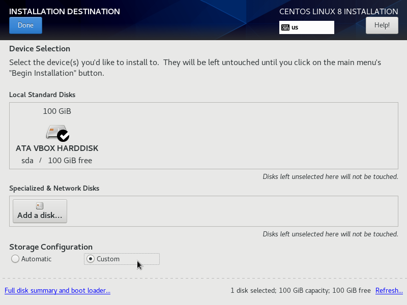

**Select the Standard Partition scheme**
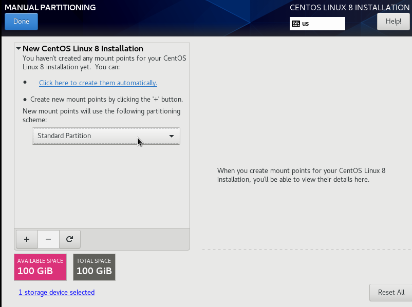

**Click the + button and add the following partitions:**
```
1GB /boot
4GB swap
Remaining Space /

Click Done when finished
```
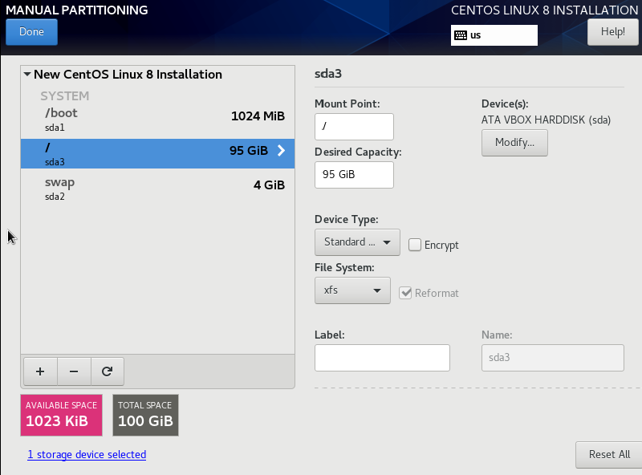

**Click on Network & Host Name**
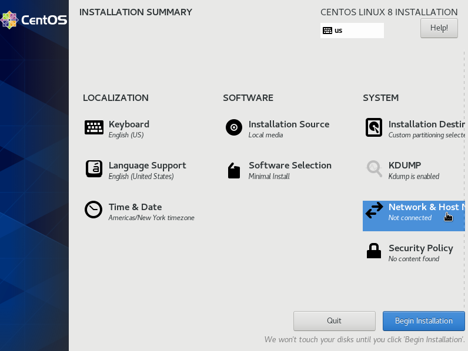

**Switch your network adapter to ON and set the Host Name to packstack**
```
Also click on Configure and setup a static IP

Click Done when finished
```
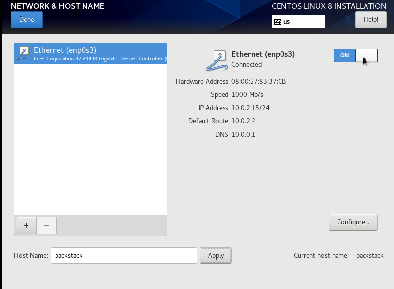

**Click on Begin Installation**
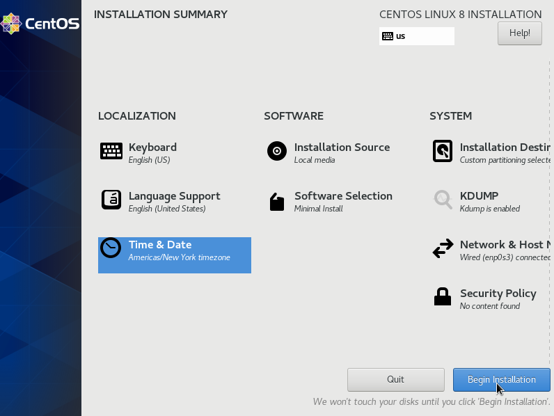

**When the installation begins set a root password**
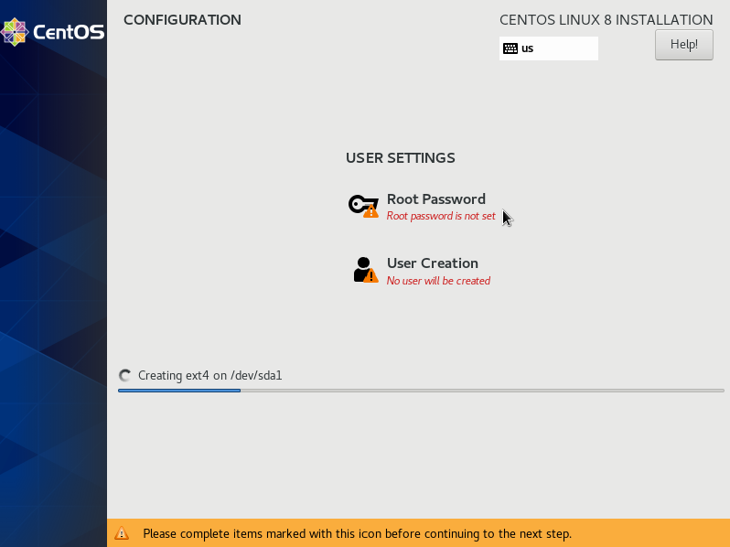


[<-- Back to Main](../README.md)